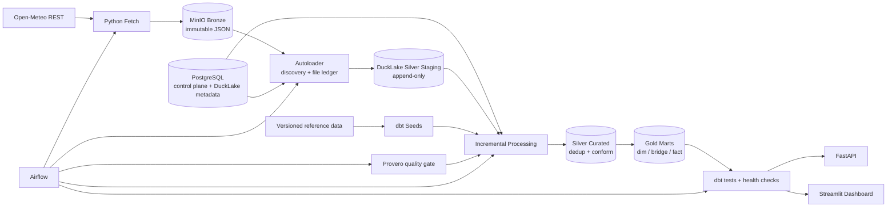

# Hanoi Flood & Climate Risk Monitor

A production-like, zero-cost data platform for monitoring heavy-rain pressure across Hanoi from hourly forecasts and historical weather data.

The project is built as a **single-node lakehouse** to demonstrate practical data engineering concerns: immutable ingestion, incremental processing, idempotency, data contracts, quality gates, orchestration, recovery, and serving. It intentionally stops short of claiming flood probability because the available data does not support that conclusion.

## What this project answers

For each Hanoi ward and forecast hour, the platform answers:

- How much rain is expected in the next 1, 3, 6, 12, and 24 hours?
- Which wards should be reviewed first based on rainfall pressure?
- Is the signal persistent across recent forecast runs?
- Is the latest 24-hour forecast rising or falling compared with the previous run?
- Is the underlying data complete, fresh, and safe to publish?
- What did historical rainfall look like around previously observed flooding events?

The main output is an **explainable rainfall-pressure signal**, not an official weather warning or a calibrated flood-probability model.

## Scale at a glance

| Area | Current scope |
|---|---|
| Geography | 126 Hanoi wards/communes |
| Forecast | 72-hour horizon, refreshed hourly |
| Forecast spatial grid | 48 ECMWF IFS cells mapped to wards |
| Historical weather | ERA5 before 2017, ECMWF IFS from 2017 onward |
| Historical ERA5 grid | 12 cells for Hanoi |
| Completed archive example | 1,106,784 ward-hour rows for year 2000 |
| Flood reference points | 15 sourced and geocoded locations |
| Runtime target | Single node, Docker Compose, zero mandatory cloud spend |

## Architecture



The physical stack is deliberately small:

```text
MinIO + PostgreSQL/DuckLake + DuckDB/dbt + Airflow
Bronze -> Silver -> Gold -> Serving
```

## Data contracts

| Layer | Contract | Responsibility |
|---|---|---|
| Bronze | Immutable source responses | Preserve replayable source data exactly as landed |
| Silver staging | Append-only parsed records | Keep source vintages and ingestion metadata |
| Silver curated | Typed, deduplicated, conformed data | Resolve late/repeated records at business grain |
| Gold | Stable analytical and serving models | Publish dimensions, facts, current forecast, and rainfall-pressure signals |

The separation is intentional: raw history stays replayable, while deduplication and business semantics remain downstream where they can be tested and changed safely.

## Engineering decisions

### 1. At-least-once ingestion, deterministic downstream correctness

PostgreSQL and DuckLake do not share a distributed transaction. A file may be written successfully to staging before its control-plane state is marked `COMMITTED`.

Instead of pretending this is exactly-once, the loader is designed for **at-least-once delivery**:

1. discover immutable objects in MinIO;
2. register unseen files in PostgreSQL;
3. claim a micro-batch with a lease;
4. insert into append-only Silver staging;
5. mark files committed after the data write succeeds;
6. deduplicate later using the business grain.

A crash between steps 4 and 5 may replay data, but it does not corrupt the final curated model.

### 2. Ingestion checkpoints and processing checkpoints are separate

The system keeps two different control-plane concepts:

```text
ingestion.*   -> Has this source file been loaded?
processing.*  -> How far has this transformation processed its upstream data?
```

A single upstream dataset can feed multiple transformations with different progress, so processing state belongs to the **process**, not to the source file ledger.

### 3. Incremental processing uses overlap, not a fragile closed window

Incremental transforms read from `checkpoint - safety_lag`. The overlap deliberately re-reads a small amount of data and relies on idempotent merge semantics.

This handles rows whose transaction timestamp is earlier than the moment they become visible to the next processing run. Advancing checkpoints only after a successful run prevents gaps after failures.

### 4. Forecast history and current serving state are different products

Every complete forecast run is retained so revisions can be audited. Gold exposes both:

- `fct_rain_forecast_hourly`: forecast history by logical run;
- `fct_rain_forecast_current_hourly`: the latest complete run for serving;
- `fct_rain_pressure_alert`: explainable ward-hour pressure level, coverage, persistence, and revision.

This avoids overwriting yesterday's forecast with today's and preserves the ability to compare model revisions.

### 5. Quality gates block publication

The pipeline treats data quality as executable logic rather than documentation.

Before downstream publication, checks cover:

- required keys and physical rainfall ranges;
- source freshness;
- duplicate business grain;
- rolling-window monotonicity;
- 126/126 ward coverage;
- forecast forward coverage;
- pressure-signal semantics;
- readability of actual Gold data files, not only catalog metadata;
- ingestion backlog, failed files, and host disk capacity.

A failing gate returns a non-zero exit code and stops the production flow.

### 6. Complexity is constrained by the deployment target

This project intentionally does **not** use Kubernetes, Kafka, Spark, multi-region storage, or active-active infrastructure. The current workload does not justify them.

The design target is a recoverable single-node system with clear correctness boundaries, not distributed infrastructure for its own sake.

## Data model

Core Gold models:

| Model | Grain | Purpose |
|---|---|---|
| `dim_ward` | one row per ward | Geographic serving dimension |
| `dim_grid` | one row per weather grid cell/model | Weather-model spatial dimension |
| `bridge_ward_grid` | ward x weather model | Maps wards to source grid cells |
| `dim_flood_point` | one row per sourced flood point | Reference locations for replay/analysis |
| `fct_rain_archive_hourly` | grid cell x observed hour | Historical rainfall fact |
| `fct_rain_forecast_hourly` | forecast run x grid cell x valid hour | Versioned forecast history |
| `fct_rain_forecast_current_hourly` | grid cell x valid hour | Latest complete forecast run |
| `fct_rain_pressure_alert` | forecast run x ward x valid hour | Explainable operational rainfall-pressure signal |

Detailed storage and grain decisions are documented in [Storage & Modeling](docs/06-storage-modeling.md).

## Reliability and observability

The production-like flow includes:

- resumable object discovery;
- lease-based file claims and retry accounting;
- immutable raw storage for replay;
- append-only staging;
- incremental processing checkpoints with audit history;
- Airflow scheduling and single-writer coordination;
- Provero checks before transformation;
- dbt schema and singular tests;
- health checks for freshness, completeness, backlog, grain, Gold readiness, and disk capacity;
- metadata and full-lakehouse backup/restore workflows;
- webhook alert integration for failed or unhealthy runs.

See [Data Quality & Observability](docs/07-data-quality.md) and the [Ingestion Runbook](docs/04b-ingestion-runbook.md).

## Tech stack

| Concern | Technology |
|---|---|
| Language | Python 3.12+ |
| Raw/object storage | MinIO |
| Lakehouse table format/catalog | DuckLake |
| Metadata & control plane | PostgreSQL |
| Query engine | DuckDB |
| Transformation | dbt-duckdb |
| Data quality | Provero + dbt tests + custom health checks |
| Orchestration | Apache Airflow |
| API | FastAPI |
| Dashboard | Streamlit + PyDeck + Altair |
| Runtime | Docker Compose |
| Dependency management | uv |
| CI | GitHub Actions |

## Quick start

### Prerequisites

- Docker with Docker Compose
- Python 3.12+
- `uv`
- GNU Make

### 1. Configure the environment

```bash
cp .env.example .env
```

Set the required local secrets in `.env`. The file is intentionally ignored by Git.

### 2. Start the runtime services

```bash
make up
```

This starts PostgreSQL, MinIO, pgAdmin, Airflow, and the dashboard.

### 3. Bootstrap storage and geography

```bash
make bootstrap
make bootstrap-geography
```

### 4. Run the forecast pipeline

```bash
make forecast-pipeline
```

The flow is:

```text
fetch -> load -> staging quality gate -> Silver/Gold processing -> health gate
```

Fetch commands are dry-run by default when called directly. Add `EXEC=1` to perform network writes:

```bash
make fetch-forecast EXEC=1
make fetch-archive START=2026-01-01 END=2026-02-01 EXEC=1
```

## Common operations

```bash
make quality                 # staging quality checks
make dbt-test                # dbt schema + singular tests
make freshness               # dbt source freshness
make health                  # operational health collector
make lint                    # static checks
make docs-check              # validate documentation links
make serve-api               # local FastAPI serving
make serve-dashboard         # local Streamlit dashboard
```

Archive loading and transformation can be run independently:

```bash
make load SOURCE="open_meteo_archive open_meteo_ifs"
make archive-pipeline START=2026-01-01 END=2026-02-01
```

## Repository structure

```text
.
├── src/
│   ├── fetch/                     # concurrent HTTP landing primitives
│   ├── autoloader/                # discovery, file ledger, lease-based loading
│   ├── processing/                # incremental processing state machine
│   └── vn_climate_risk_monitor/   # domain, storage, health, Open-Meteo logic
├── sources/                       # source contracts + SQL parsing rules
├── transform/
│   ├── models/staging/            # thin dbt source views
│   ├── models/intermediate/       # curated incremental models
│   ├── models/marts/              # dimensions, bridges, facts
│   └── tests/                     # cross-row/business-invariant tests
├── orchestration/dags/            # Airflow production flows
├── quality/                       # Provero staging checks
├── serving/                       # FastAPI + Streamlit
├── reference/                     # versioned geographic reference data
├── scripts/                       # bootstrap, health, recovery, maintenance
├── tests/unit/                    # Python unit tests
└── docs/                          # design, modeling, runbooks, governance
```

See [Repository Structure](docs/03a-repo-structure.md) for the full map.

## Scope and trade-offs

This is a **portfolio production-like system**, not a claim of city-scale production infrastructure.

Current constraints are explicit:

- one-node deployment;
- Open-Meteo Free API availability and quota constraints;
- several wards share the same source weather grid cell;
- rainfall forcing is not street-level rainfall observation;
- no sewer-network, water-level, detailed terrain, or representative negative-label dataset;
- rainfall-pressure thresholds are version-controlled heuristics, not calibrated flood probabilities;
- no high availability or multi-region disaster recovery.

These constraints are surfaced in the product rather than hidden behind false precision.

## Documentation

The README is intentionally an overview. Design rationale and operating detail live in focused documents:

- [Business Problem](docs/01-business-problem.md)
- [Data Sources](docs/02-data-sources.md)
- [Architecture](docs/03-architecture.md)
- [Repository Structure](docs/03a-repo-structure.md)
- [Lakehouse Setup](docs/04a-lakehouse-setup.md)
- [Ingestion Runbook](docs/04b-ingestion-runbook.md)
- [KPI Methodology](docs/05-kpi-methodology.md)
- [Storage & Modeling](docs/06-storage-modeling.md)
- [Data Quality & Observability](docs/07-data-quality.md)
- [Serving & BI](docs/08-serving-bi.md)
- [Governance](docs/09-governance.md)

## Data usage

Open-Meteo Free API is used for non-commercial portfolio purposes. Published Open-Meteo-derived data must retain the required attribution. Reference datasets remain subject to their original source terms.
