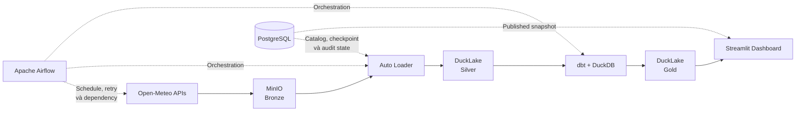

# VN Climate Risk Monitor

### Nền tảng giám sát áp lực mưa và phát lại dữ liệu ngập lụt lịch sử tại Hà Nội


## Bài toán

Mưa lớn và ngập lụt đô thị có thể gây gián đoạn giao thông, ảnh hưởng sinh hoạt
và tạo áp lực lên hạ tầng của Hà Nội. Để hỗ trợ việc theo dõi rủi ro, dữ liệu dự
báo cần được cập nhật thường xuyên, dữ liệu lịch sử cần có khả năng phát lại, và
mọi kết quả công bố phải truy vết được về nguồn.

VN Climate Risk Monitor xây dựng một data platform tự động cho **126 phường/xã
của Hà Nội**. Hệ thống thu thập dữ liệu thời tiết theo giờ từ Open-Meteo, lưu
nguyên bản phản hồi nguồn, xử lý dữ liệu theo kiến trúc medallion và hiển thị:

- dự báo mưa trong 72 giờ;
- chỉ số áp lực mưa có thể giải thích theo từng phường/xã;
- dữ liệu mưa lịch sử đặt cạnh các quan sát ngập đã được kiểm chứng;
- trạng thái pipeline, checkpoint, lineage và lịch sử publication.

> [!IMPORTANT]
> Đây là dự án portfolio chạy trên một máy cục bộ. Hệ thống không phải cảnh báo
> thời tiết chính thức, không dự đoán xác suất ngập và không được thiết kế như
> một dịch vụ high availability.

## Kiến trúc hệ thống



| Lớp | Thành phần | Trách nhiệm |
|---|---|---|
| Source | Open-Meteo Forecast & Archive APIs | Cung cấp dự báo và dữ liệu thời tiết lịch sử theo giờ |
| Bronze | MinIO | Lưu nguyên byte phản hồi HTTP bằng object key bất biến |
| Control plane | PostgreSQL | Lưu catalog DuckLake, lease, checkpoint, retry và audit state |
| Silver | Auto Loader + DuckLake | Parse file nguồn, nạp staging và giữ `_source_file` lineage |
| Transform | dbt + DuckDB | Chuẩn hóa, loại trùng, kiểm thử và xây dựng Gold marts |
| Orchestration | Apache Airflow | Lập lịch, quản lý dependency, retry và single-writer pool |
| Serving | Streamlit | Đọc snapshot đã kiểm thử và hiển thị dashboard |

Thiết kế sử dụng một writer duy nhất để giữ quá trình phục hồi dễ hiểu và phù
hợp với môi trường local. Dashboard luôn pin vào một `published_snapshot_id` đã
vượt qua toàn bộ dbt tests, tránh việc một trang đọc lẫn dữ liệu từ hai lần công
bố khác nhau.

Chi tiết về ownership, publication và các đánh đổi kỹ thuật nằm trong
[tài liệu kiến trúc](docs/03-architecture.md).

## Tech Stack

### Lưu trữ và truy vấn


### Data Engineering


### Dashboard


### Containerization


### Thư viện chính

| Thư viện | Vai trò |
|---|---|
| `duckdb` | Compute engine và kết nối DuckLake |
| `minio` | Đọc/ghi dữ liệu Bronze trên object storage |
| `psycopg` | Truy cập PostgreSQL control plane |
| `dbt-duckdb` | Transformation, data tests và publication |
| `streamlit` | Xây dựng giao diện dashboard |
| `pydeck` | Hiển thị bản đồ tương tác |
| `pandas` và `altair` | Xử lý và trực quan hóa dữ liệu trên dashboard |

## Cấu trúc dự án

```text
vn-climate-risk-monitor/
│
├── docker/                         # Dockerfile cho Airflow và dashboard
├── docs/                           # Kiến trúc, data contract và runbook
├── orchestration/
│   └── dags/                       # Forecast, archive và maintenance DAGs
├── scripts/                        # Backup, restore và kiểm tra tài liệu
├── serving/
│   └── dashboard/                  # Ứng dụng Streamlit và query modules
├── src/vn_climate_risk_monitor/
│   ├── auto_loader/                # Bronze → Silver staging và parser SQL
│   ├── auto_process/               # Silver → Gold với dbt
│   ├── operations/                 # Bootstrap, maintenance và reset
│   ├── platform/                   # Settings và storage adapters
│   ├── quality/                    # Health và readiness checks
│   └── sources/open_meteo/         # Lập kế hoạch và tải dữ liệu nguồn
├── tests/                          # Unit tests và contract tests
├── tools/                          # Geocoding, scraping và tạo GeoJSON
├── transform/
│   ├── macros/                     # Incremental scope và data quality
│   ├── models/                     # Staging, intermediate và Gold marts
│   ├── seeds/                      # Geography và flood references
│   └── tests/                      # dbt singular tests
├── .env.example                    # Mẫu cấu hình local
├── docker-compose.yml              # Toàn bộ single-node runtime
├── pyproject.toml                  # Package, dependencies và CLI entry points
└── uv.lock                         # Dependency lockfile
```

## Nguồn dữ liệu

| Nguồn | Loại dữ liệu | Phạm vi | Mục đích |
|---|---|---|---|
| Open-Meteo Forecast API | Thời tiết theo giờ | 72 giờ tiếp theo | Dự báo mưa và tính rainfall-pressure signal |
| Open-Meteo Archive API | Thời tiết lịch sử theo giờ | ERA5 trước 2017, ECMWF IFS từ 2017 | Phát lại dữ liệu mưa lịch sử |
| Geography seeds | Tọa độ, ranh giới và ánh xạ weather grid | 126 phường/xã Hà Nội | Liên kết dữ liệu thời tiết với địa giới hành chính |
| Flood reference seeds | Điểm ngập và quan sát sự kiện | Dữ liệu tham chiếu đã chuẩn hóa | Đặt lượng mưa lịch sử trong bối cảnh ngập thực tế |

Forecast và archive sử dụng grain riêng. Mỗi bản ghi staging giữ metadata ingestion
và `_source_file`; các mô hình thời tiết lịch sử không bị trộn âm thầm vào cùng
một grid. Xem [data contracts](docs/04-data-contracts.md) để biết đầy đủ grain,
quality gates và Gold models.

## Các giai đoạn pipeline

- [x] **Lập kế hoạch và thu thập:** chia request theo weather grid, hỗ trợ dry run,
  retry và bỏ qua object đã tồn tại.
- [x] **Bronze landing:** ghi nguyên phản hồi Open-Meteo vào MinIO bằng key bất biến.
- [x] **Silver ingestion:** tự động discovery, lease file và nạp staging idempotent.
- [x] **Gold transformation:** chạy dbt build với checkpoint incremental và data tests.
- [x] **Publication:** chỉ công bố snapshot sau khi toàn bộ graph và tests thành công.
- [x] **Serving:** dashboard đọc snapshot hợp lệ ở chế độ read-only.
- [x] **Operations:** health check, rewind, abandon, retention, backup và restore.

Hai data DAG dùng cùng một luồng:

```text
copy_raw → autoload_staging → process_dbt → health
```

| DAG | Lịch mặc định | Chức năng |
|---|---|---|
| `open_meteo_forecast_hourly` | Phút 15 mỗi giờ | Cập nhật dự báo 72 giờ |
| `open_meteo_archive_monthly` | 02:30 ngày đầu tháng | Nạp thêm dữ liệu archive |
| `lakehouse_maintenance_daily` | 03:30 mỗi ngày | Retention snapshot và dọn file an toàn |

## Dashboard

Dashboard Streamlit gồm ba luồng khám phá chính:

### Bản đồ dự báo

Hiển thị horizon dự báo mới nhất trên bản đồ phường/xã, cho phép đổi mốc giờ,
chỉ báo, lớp điểm và cách thể hiện. Bảng xếp hạng giúp so sánh áp lực mưa và
lượng mưa dự kiến giữa các khu vực.

### Chi tiết phường/xã

Đi sâu vào chuỗi thời gian của một địa bàn: lượng mưa theo cửa sổ, pressure
signal, độ dai dẳng và các điểm ngập tham chiếu lân cận.

### Phát lại quá khứ

Phát lại lượng mưa lịch sử theo ngày và giờ địa phương, đồng thời đặt dữ liệu
khí tượng cạnh các quan sát ngập đã được kiểm chứng.

## Hướng dẫn chạy

### Yêu cầu

| Công cụ | Mục đích |
|---|---|
| [Git](https://git-scm.com/downloads) | Clone source code |
| [Docker Desktop](https://www.docker.com/products/docker-desktop/) | Chạy toàn bộ local stack bằng Docker Compose |
| [uv](https://docs.astral.sh/uv/getting-started/installation/) | Chạy CLI, test và công cụ phát triển trực tiếp trên máy host |

### 1. Clone repository

```bash
git clone https://github.com/DKSang/vn-climate-risk-monitor.git
cd vn-climate-risk-monitor
```

### 2. Tạo cấu hình local

Trên PowerShell:

```powershell
Copy-Item .env.example .env
```

Mở `.env` và thay toàn bộ giá trị `<...>` bằng credential local. Không commit
file này vào Git. `AIRFLOW_FERNET_KEY` phải là một Fernet key hợp lệ.

### 3. Khởi động platform

```powershell
docker compose up -d --build
docker compose ps
```

Service `bootstrap` chạy một lần để tạo MinIO bucket, DuckLake catalog, các bảng
control-plane, geography seeds và những Gold dimensions tĩnh.

| Giao diện | Địa chỉ mặc định |
|---|---|
| Streamlit dashboard | [http://localhost:8501](http://localhost:8501) |
| Apache Airflow | [http://localhost:8080](http://localhost:8080) |
| MinIO Console | [http://localhost:9001](http://localhost:9001) |

pgAdmin là service tùy chọn:

```powershell
docker compose --profile tools up -d pgadmin
```

Sau đó mở [http://localhost:5050](http://localhost:5050).

### 4. Nạp dữ liệu lần đầu

Ví dụ dưới đây nạp forecast hiện tại và một tháng archive ngay trong container
Airflow:

```powershell
docker compose exec airflow uv run fetch-open-meteo forecast --execute
docker compose exec airflow uv run fetch-open-meteo archive --start 2025-01-01 --end 2025-02-01 --execute
docker compose exec airflow uv run auto-loader
docker compose exec airflow uv run auto-process run
docker compose exec airflow uv run pipeline-health --scope all --require-gold
```

Ở lần xử lý đầu tiên, không truyền group cho `auto-loader` và `auto-process run`.
Hệ thống sẽ nạp cả hai nguồn và tự xử lý archive trước forecast. Sau khi khởi tạo
xong, có thể unpause các DAG trong Airflow để cập nhật tự động.

## Các lệnh vận hành

```text
fetch-open-meteo forecast --execute
fetch-open-meteo archive --start 2025-01-01 --end 2025-02-01 --execute
auto-loader forecast
auto-process run forecast
auto-process status forecast
auto-process reprocess-from forecast --from 2025-01-01T00:00:00Z --reason "parser fix"
auto-process abandon forecast --reason "replace an abandoned worker run"
pipeline-health --scope all --require-gold
maintain-lakehouse --snapshot-retention-days 7 --file-grace-days 2
```

Các thao tác retry, rewind và reload đều giữ Bronze làm recovery boundary. Xem
[runbook vận hành](docs/05-operations.md) trước khi reset, backup hoặc restore.

## Phát triển và kiểm thử

Cài dependency từ lockfile:

```powershell
uv sync --frozen
```

Chạy các quality gates trước khi chia sẻ thay đổi:

```powershell
uv run pytest -q
uv run ruff check .
$env:PYTHONUTF8 = "1"
uv run dbt parse --project-dir transform --profiles-dir transform
docker compose config
uv run python scripts/check_docs.py
```

`PYTHONUTF8=1` giúp dbt đọc nhất quán tên địa danh tiếng Việt khi chạy trực tiếp
trên Windows. Container và CI đã sử dụng UTF-8 locale.

## Tài liệu

- [Kiến trúc hệ thống](docs/03-architecture.md) — ownership, publication và trade-offs.
- [Data contracts](docs/04-data-contracts.md) — source grain, quality gates và Gold models.
- [Vận hành](docs/05-operations.md) — bootstrap, retry, rewind, maintenance và recovery.

## Giới hạn thiết kế

- Chạy theo mô hình local single-node, single-writer; không hỗ trợ HA hoặc scale-out.
- Pressure signal phản ánh áp lực khí tượng, không phải xác suất hay độ sâu ngập.
- Geography và flood references là dữ liệu seed có version, không phải nguồn realtime.
- Credential trong `.env` chỉ phù hợp cho môi trường local, không thay thế secret
  management của production.
