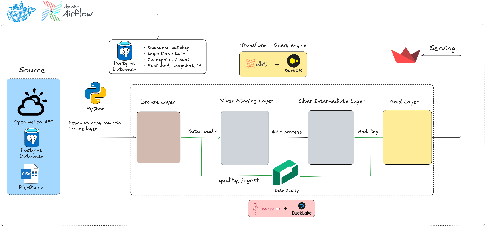
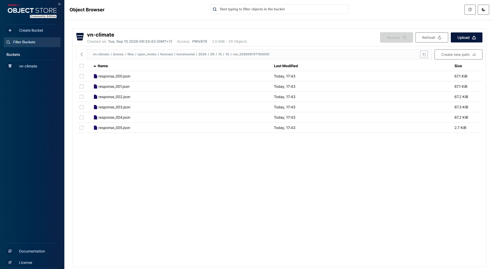
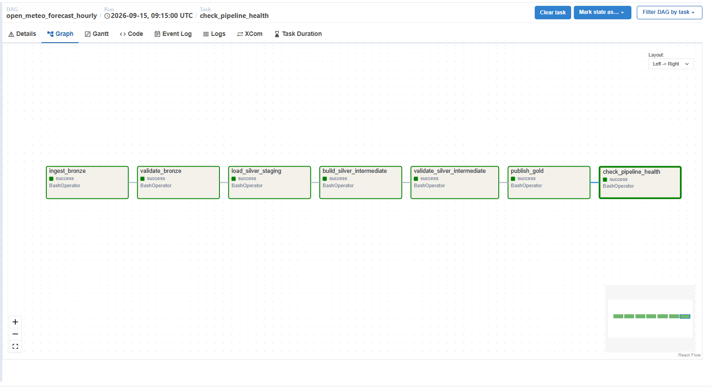
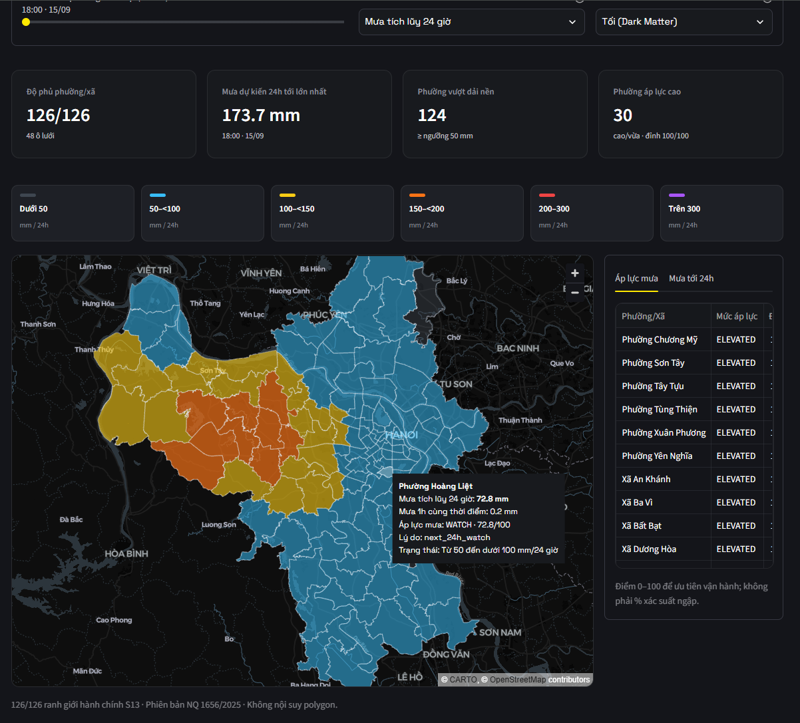
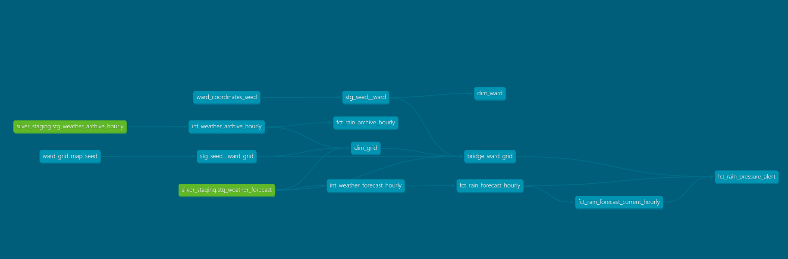

# VN Climate Risk Monitor

Airflow • dbt • DuckDB/DuckLake • MinIO • PostgreSQL • Docker

An end-to-end data platform that turns hourly Open-Meteo weather data into tested rainfall
insights for 126 administrative areas in Hanoi.


[](https://github.com/DKSang/vn-climate-risk-monitor/actions/workflows/ci.yml)

> Portfolio scope: local single-node, single-writer system designed to demonstrate data
> engineering fundamentals. It is not an official weather warning or flood prediction service.

| 126 administrative areas | 72-hour forecast | Hourly orchestration | 141 dbt data tests · 216 unit tests |
|---|---|---|---|
| Hanoi wards/communes | Forecast horizon | Airflow forecast DAG | Quality and behavior coverage |

## What this project demonstrates

- Batch ingestion from external APIs with deterministic request windows and retry-safe object keys.
- Immutable Bronze storage on MinIO with source-file lineage retained into Silver.
- Stateful incremental loading with PostgreSQL leases, checkpoints, retries and processing audit.
- dbt/DuckDB transformations with explicit grains, deduplication and data quality tests.
- Airflow orchestration for forecast, archive and lakehouse maintenance workflows.
- Fail-closed publication: Gold is exposed only after transformation and validation succeed.
- Snapshot-pinned Streamlit serving so one dashboard view never mixes two pipeline publications.
- Reproducible local deployment and CI checks using Docker Compose, uv, Ruff, pytest and dbt.

## Business problem

Heavy rainfall can disrupt transport and urban infrastructure in Hanoi. The project turns raw
weather API responses into a traceable analytical product for 126 wards/communes:

- 72-hour rainfall forecast;
- rainfall-pressure signal by ward/commune;
- historical rainfall replay by hour and weather model;
- pipeline health, checkpoint, lineage and publication metadata.

The pressure signal is an explainable prioritization metric based on rainfall forecasts and
persistence. It is not a flood probability or flood-depth model.

## Architecture



```text
Open-Meteo Forecast / Archive APIs
                │
                ▼
        Python ingestion
                │
                ▼
       MinIO Bronze objects
       immutable raw bytes
                │
                ▼
      Auto Loader + DuckLake
          Silver staging
                │
                ▼
          dbt + DuckDB
   intermediate → Gold marts
                │
                ▼
        Streamlit dashboard

PostgreSQL: catalog + ingestion/process control state
Airflow: schedule + dependencies + retries + single-writer coordination
```

| Layer | Technology | Responsibility |
|---|---|---|
| Source | Open-Meteo | Forecast and historical hourly weather data |
| Bronze | MinIO | Immutable raw HTTP responses for replay and audit |
| Control plane | PostgreSQL | Catalog, leases, checkpoints, retries and publication state |
| Silver | Auto Loader + DuckLake | Parse new files, append staging rows and preserve `_source_file` lineage |
| Transform | dbt + DuckDB | Normalize, deduplicate, validate and build analytical marts |
| Orchestration | Apache Airflow | Schedule workflows, manage retries and serialize writes |
| Serving | Streamlit | Read validated Gold snapshots for maps and drill-down views |

### Raw lakehouse layout

Bronze objects are organized by source, data mode and time window so a failed or historical run
can be traced back to the exact raw responses that produced it.



### Pipeline flow

Both data pipelines follow the same seven-stage contract:

```text
ingest Bronze
    ↓
validate Bronze
    ↓
load Silver staging
    ↓
build Silver intermediate
    ↓
validate Silver intermediate
    ↓
publish Gold
    ↓
check pipeline health
```

The forecast DAG runs hourly. The archive DAG runs monthly. A maintenance DAG applies snapshot
retention and safe file cleanup.



### Pipeline scale and runtime

The figures below combine design-time volume formulas with local runs measured on 16 Sep 2026.
Runtime varies with API latency, machine resources and whether the run is a first load or an
incremental update.

| Pipeline | Input volume per run | Output volume per run | Processing time |
|---|---|---|---|
| Forecast, hourly | 126 locations × 72 hours = **9,072 source rows**; 6 API requests with batch size 25 | 48 weather grids × 72 hours = **3,456 curated rows**; ward serving layer = **9,072 rows** | **31–59s end-to-end** on recent successful Airflow runs; **18–32s** for processing and publication |
| Archive, monthly | 31-day month: 48 IFS grids × 31 × 24 = **35,712 source rows**, or 12 ERA5 grids × 31 × 24 = **8,928 rows**; 2 IFS requests or 1 ERA5 request | 31-day IFS month = **35,712 rows**; 31-day ERA5 month = **8,928 rows** | **344.9s (~5m45s)** for a measured full IFS month processing run; **38.7s** for an already-covered rerun |

The measured local Bronze footprint was approximately **2.76 MB for 8 forecast vintages** and
**1.29 MB for one archive month**. The latest local Gold tables contained **27,648 forecast
history rows**, **3,456 current forecast rows**, **9,072 pressure rows** and **35,712 archive
rows**. These are reproducible sample-run figures, not a production capacity claim.

## Dashboard

The Streamlit dashboard reads a pinned Gold snapshot for a consistent view of current forecast
pressure across Hanoi wards and communes.



## Reliability and data quality

The project intentionally focuses on correctness and recoverability rather than scale for its own
sake.

| Concern | Design |
|---|---|
| Replay | Raw API response bytes are kept in Bronze with deterministic object paths |
| Idempotency | Existing Bronze objects are not duplicated; Silver reloads replace rows by source file |
| Incremental state | PostgreSQL stores file leases, processing runs and checkpoints |
| Failure recovery | Checkpoints advance only after a successful publication |
| Data quality | Provero gates Raw/Silver inputs; dbt generic and singular tests validate transformed data |
| Consistent serving | Dashboard reads the latest validated `published_snapshot_id` |
| Concurrency | Airflow uses a single-writer pool for DuckLake mutation |
| Backup / restore | Operational scripts cover lakehouse and metadata backup, verification and restore |
| CI | Ruff, pytest, docs validation, Compose validation, dbt parse/compile, image build and DAG import |

Examples of tested contracts include uniqueness, non-null keys, rainfall ranges, forecast horizon
coverage, stable time-based keys, ward-grid coverage and Gold table grains.



## Data products

Important Gold models:

| Model | Grain | Purpose |
|---|---|---|
| `dim_ward` | one row per Hanoi ward/commune | Geography dimension |
| `dim_grid` | one row per weather grid cell | Weather-grid dimension |
| `bridge_ward_grid` | ward × weather model | Stable mapping from administrative area to weather grid |
| `fct_rain_archive_hourly` | grid × hour | Historical rainfall and rolling windows |
| `fct_rain_forecast_hourly` | forecast run × grid × hour | Full forecast-vintage history |
| `fct_rain_forecast_current_hourly` | latest run × grid × hour | Current forecast serving view |
| `fct_rain_pressure_alert` | ward × hour | Explainable rainfall-pressure signal |

Detailed grains, quality rules and model contracts are documented in
[`docs/04-data-contracts.md`](docs/04-data-contracts.md).

## Why these technologies

| Technology | Why it exists in this project |
|---|---|
| MinIO | Demonstrates durable object-storage landing and replay without requiring a cloud account |
| DuckDB + DuckLake | Provides local analytical SQL plus lakehouse-style snapshots/catalog behavior |
| PostgreSQL | Keeps durable control state separate from analytical data |
| dbt | Makes SQL transformations, dependencies and data tests explicit and reviewable |
| Airflow | Demonstrates scheduling, dependency management, retries and backfill-oriented orchestration |
| Streamlit | Provides a small downstream consumer that proves Gold datasets are usable |

The system deliberately avoids Kubernetes, Kafka and distributed compute because the current data
volume and latency requirements do not justify their operational complexity.

## Repository structure

> The codebase is being rebuilt in small phases (see [`CONTEXT.md`](CONTEXT.md) and
> [`docs/adr/`](docs/adr/)). Phases 1–5 rebuilt the forecast pipeline end to end, from Bronze to a
> published Gold snapshot; the dashboard and the archive pipeline are rebuilt next.

```text
vn-climate-risk-monitor/
├── pipeline/               # Python package run by Airflow
│   ├── settings.py         # environment variables
│   ├── lake.py             # the one place that attaches DuckLake (Postgres catalog + MinIO)
│   ├── job_run.py          # start-time watermark pattern (ADR 0001)
│   ├── meta.sql            # meta.watermarks, meta.job_runs
│   ├── init.py             # idempotent lake setup (`uv run init-lakehouse`)
│   ├── maintain.py         # DuckLake snapshot/file retention
│   ├── quality.py          # Great Expectations gates
│   ├── dbt.py              # runs dbt in-process
│   └── open_meteo/         # fetch -> Bronze, load -> stg_, clean -> clean_, gold + publish
├── dags/                   # Airflow DAGs
├── transform/              # dbt project
├── dashboard/              # Streamlit app
├── docker/                 # Dockerfiles, Postgres init script
├── scripts/                # repository checks and one-time data tools
├── tests/
│   ├── unit/
│   └── integration/        # needs a running Postgres
├── docs/                   # architecture, ADRs, agent docs
├── docker-compose.yml
├── pyproject.toml
└── uv.lock
```

## Run locally

Requirements: Git and Docker Desktop.

```powershell
git clone https://github.com/DKSang/vn-climate-risk-monitor.git
cd vn-climate-risk-monitor
Copy-Item .env.example .env
docker compose up -d --build
docker compose ps
```

Local interfaces:

| Service | URL | Default local account |
|---|---|---|
| Streamlit | http://localhost:8501 | none |
| Airflow | http://localhost:8080 | `admin` / `admin` |
| MinIO Console | http://localhost:9001 | `minioadmin` / `minioadmin` |

Unpause and trigger `open_meteo_forecast_hourly` in Airflow to populate the current forecast.
Trigger `open_meteo_archive_monthly` when historical replay data is needed.

`.env.example` contains local-only credentials. Change them when the machine is accessible to other
users and never commit the generated `.env` file.

## Development checks

```powershell
uv sync --frozen
uv run ruff check .
docker compose up -d postgres   # tests/integration need a real Postgres
uv run pytest -q
$env:PYTHONUTF8 = "1"
uv run dbt parse --project-dir transform --profiles-dir transform
docker compose config --quiet
uv run python scripts/check_docs.py
```

CI additionally compiles the dbt project, builds the runtime images and imports every Airflow DAG.

## Documentation

- [`docs/03-architecture.md`](docs/03-architecture.md) — ownership, publication model and engineering trade-offs.
- [`docs/04-data-contracts.md`](docs/04-data-contracts.md) — source/model grains, quality rules and Gold contracts.
- [`docs/05-operations.md`](docs/05-operations.md) — retry, backfill, health checks, backup, restore and recovery.
- [`transform/README.md`](transform/README.md) — dbt build and seed workflow.

## Current limitations

- Single-node and single-writer: no high availability or horizontal write scaling.
- Local Docker Compose deployment: production IAM, secret management and network isolation are out of scope.
- Static versioned geography references rather than a real-time administrative boundary source.
- Rainfall pressure is a meteorological prioritization signal, not an official hazard alert.
