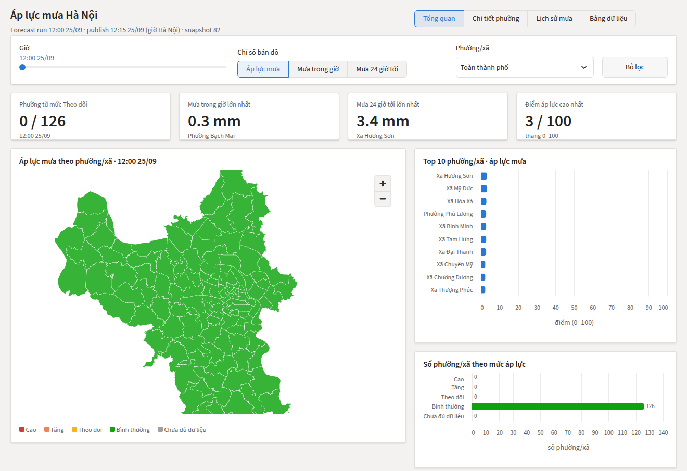
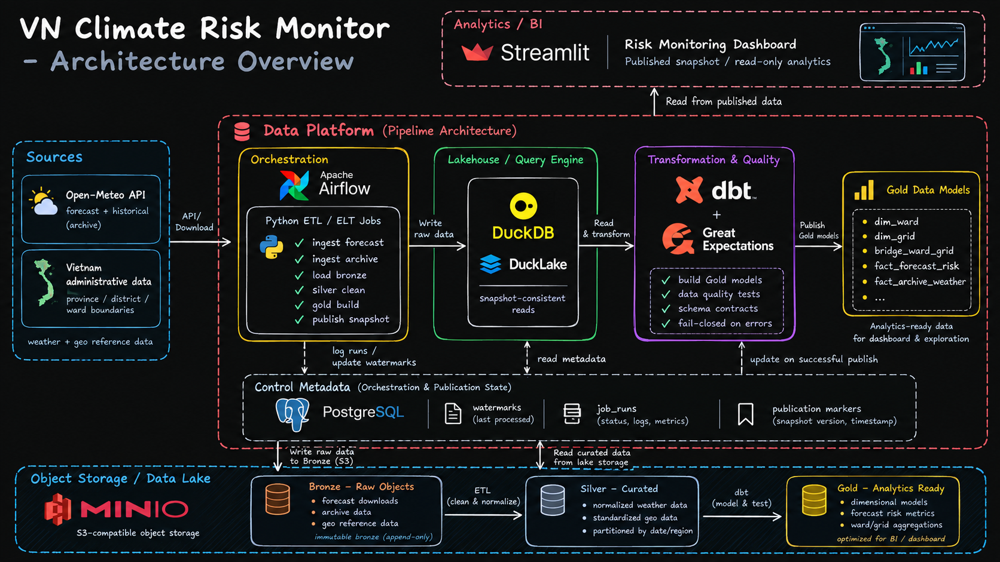
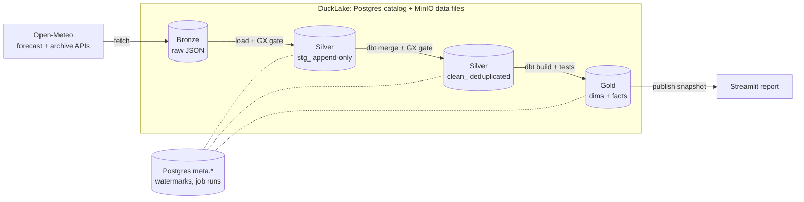
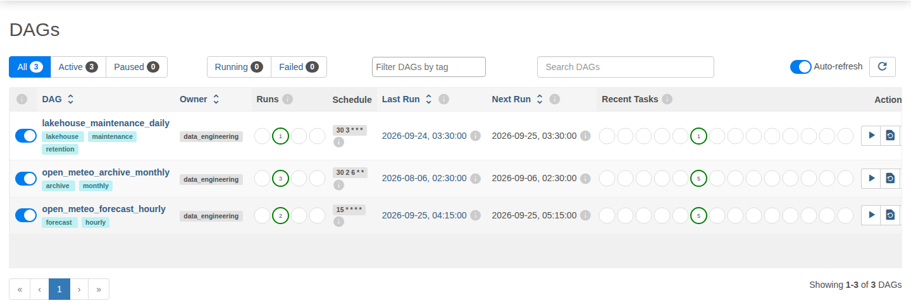
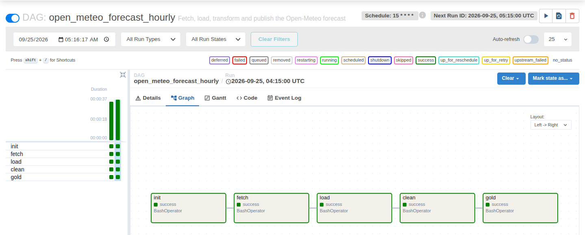
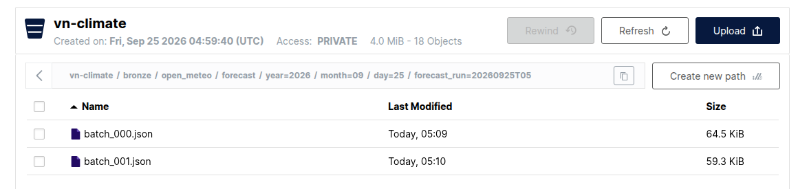
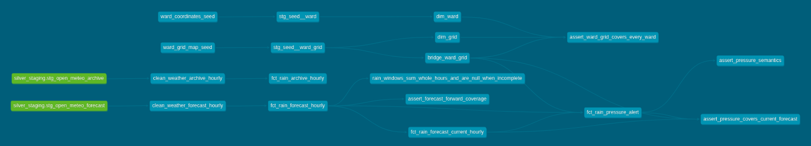
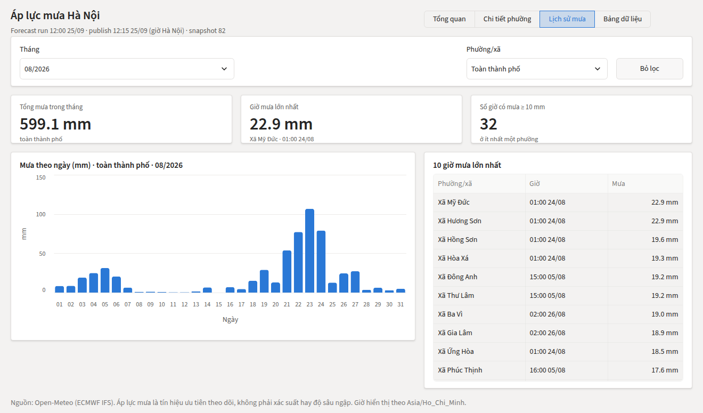

# VN Climate Risk Monitor

Airflow • dbt • DuckDB/DuckLake • MinIO • PostgreSQL • Great Expectations • Streamlit

A batch lakehouse that turns Open-Meteo weather data into tested rainfall signals for
Hanoi's 126 wards and communes: a 72-hour rain-pressure forecast, refreshed every hour, and a
month-by-month rainfall history.


[](https://github.com/DKSang/vn-climate-risk-monitor/actions/workflows/ci.yml)



> Portfolio project: a local, single-node system built to show data engineering fundamentals.
> The rain-pressure signal is a prioritisation aid, not an official weather warning or flood model.

| 126 wards · 48 grid cells | Hourly forecast, monthly archive | 58 dbt tests · 41 pytest tests | One `docker compose up` |
|---|---|---|---|

## What it demonstrates

- **Immutable Bronze.** API responses land byte-for-byte in MinIO under Hive-style
  `year=/month=/day=` paths. Deterministic keys make a retried fetch skip what already landed.
- **Incremental loading with watermarks.** Each asset reads only rows newer than the start time
  of its last successful run, kept in Postgres. One pattern covers Python and dbt
  ([ADR 0001](docs/adr/0001-watermark-incremental-pattern.md)).
- **Idempotent Silver.** Staging is append-only. dbt deduplicates new rows, then merges them on
  the business key, so a re-run or a reprocessed range never creates duplicates.
- **Two layers of data quality.** Great Expectations gates the data after Bronze and after Silver
  (volume, completeness, uniqueness, validity, freshness). dbt tests the transformations
  ([ADR 0003](docs/adr/0003-great-expectations-gates-and-dbt-tests.md)).
- **Fail-closed publication.** Gold becomes visible only as a DuckLake snapshot tagged `publish`
  after every model and test passes. The report pins that snapshot
  ([ADR 0002](docs/adr/0002-publish-a-ducklake-snapshot.md)).
- **Orchestration.** Airflow runs hourly and monthly DAGs with retries, backfill, and a
  single-writer pool.
- **Reproducible delivery.** Docker Compose, a locked `uv` environment and CI. CI runs Ruff, pytest
  against real Postgres and S3, dbt compile, image builds and a DAG import check.

## Architecture





| Layer | Technology | Responsibility |
|---|---|---|
| Source | Open-Meteo (ECMWF IFS) | Hourly forecast and archive rainfall |
| Bronze | MinIO | Raw responses kept for replay and audit |
| Silver | Python + DuckLake, dbt | `stg_` append-only loads, then deduplicated `clean_` tables |
| Gold | dbt + DuckDB | Star schema: ward and grid dimensions, rainfall facts, rain pressure |
| Control | PostgreSQL | DuckLake catalog, `meta.watermarks`, `meta.job_runs`, Airflow metadata |
| Orchestration | Airflow | Schedules, retries, backfill, single-writer pool |
| Serving | Streamlit | Power BI-style report on the published snapshot |

More in [1. Architecture](docs/01-architecture.md).

## Pipelines

Both data DAGs run the same five tasks: `init → fetch → load → clean → gold`.

| DAG | Schedule | Unit of work |
|---|---|---|
| `open_meteo_forecast_hourly` | every hour at :15 | One forecast run: 48 grid cells × 72 hours |
| `open_meteo_archive_monthly` | day 6 of each month | One calendar month; history is loaded with `airflow dags backfill` |
| `lakehouse_maintenance_daily` | daily | Expire old snapshots, delete unreferenced files |





Bronze keeps each forecast run under its own partition:



## Data model

| Gold model | Grain | Purpose |
|---|---|---|
| `dim_ward` | ward | 126 Hanoi wards and communes |
| `dim_grid` | grid cell | Weather-model grid cells |
| `bridge_ward_grid` | ward × weather model | The grid cell each ward reads |
| `fct_rain_forecast_hourly` | forecast run × grid cell × hour | Forecast history with rolling and forward rain windows |
| `fct_rain_forecast_current_hourly` | grid cell × hour | The latest forecast run (view) |
| `fct_rain_pressure_alert` | ward × hour | Rain-pressure level, 0–100 score and the reasons |
| `fct_rain_archive_hourly` | grid cell × hour | Past rainfall with windows across month boundaries |



Keys, grains and the pressure rules are in [2. Data contracts](docs/02-data-contracts.md). The
checks are in [3. Data quality](docs/03-data-quality.md).

## Report

One report with page tabs, in the style of Power BI:

- slicers for hour, map metric and ward;
- KPI cards, a ward choropleth, a top-10 ranking and the pressure-level mix;
- clicking a ward on the map or the ranking cross-filters every visual;
- the **Lịch sử mưa** (rain history) page: a month slicer, monthly KPIs, daily rainfall and the
  ten heaviest hours.



## Measured run

Measured on 25 Sep 2026 with the Compose stack on one machine. It ran three archive months
(Jun–Aug 2026) and two hourly forecast runs through Airflow.

| Pipeline | Bronze per run | Rows per run | Airflow DAG run |
|---|---|---|---|
| Forecast, hourly | 2 objects, ~0.12 MB | 3,456 grid rows; 9,072 ward pressure rows | ~37 s |
| Archive, one month | 2 objects, ~0.8 MB | 35,712 grid rows (31 days) | ~40 s |
| Maintenance | – | – | ~21 s |

Within a run, loading to `stg_` takes 1 s or less, the clean merge about 6 s and the Gold build with
its tests about 7 s. The rest is task start-up. These are sample figures from a local run, not a
capacity claim.

## Run locally

Requirements: Git and Docker.

```powershell
git clone https://github.com/DKSang/vn-climate-risk-monitor.git
cd vn-climate-risk-monitor
Copy-Item .env.example .env        # then change the passwords
docker compose up -d --build
```

| Service | URL | Login |
|---|---|---|
| Report | http://localhost:8501 | none |
| Airflow | http://localhost:8080 | from `.env` (`admin` / `admin`) |
| MinIO console | http://localhost:9001 | from `.env` (`minioadmin` / `minioadmin`) |

In Airflow, unpause `open_meteo_forecast_hourly` for the live forecast. Load history with:

```powershell
docker compose exec airflow airflow dags backfill open_meteo_archive_monthly -s 2026-01-01 -e 2026-08-31
```

Day-to-day operation (reprocessing, skipping a bad file, maintenance) is covered in
[4. Operations](docs/04-operations.md).

## Development

Integration tests reset the lake they connect to (tables, Bronze objects and `meta`), so run them
against a fresh stack, not one that holds data you want to keep.

```powershell
uv sync
docker compose up -d postgres minio     # integration tests need both
uv run ruff check .
uv run pytest
uv run dbt parse --project-dir transform --profiles-dir transform
uv run python scripts/check_docs.py
```

## Repository structure

```text
├── pipeline/              # Python package run by Airflow
│   ├── settings.py        # environment variables
│   ├── lake.py            # the one place that attaches DuckLake (Postgres catalog + MinIO)
│   ├── job_run.py         # start-time watermark pattern (ADR 0001)
│   ├── meta.sql           # meta.watermarks, meta.job_runs
│   ├── quality.py         # Great Expectations gates
│   ├── dbt.py             # runs dbt in-process
│   ├── init.py            # idempotent lake setup
│   ├── maintain.py        # snapshot and file retention
│   └── open_meteo/        # fetch -> Bronze, load -> stg_, clean -> clean_, gold + publish
├── transform/             # dbt project (Silver clean, Gold, tests, seeds)
├── dags/                  # Airflow DAGs
├── dashboard/             # Streamlit report: app, queries, ui
├── docker/                # Dockerfiles, Airflow entrypoint, Postgres init
├── scripts/               # one-time reference-data tools and repo checks
├── tests/                 # pytest: integration (Postgres + S3) and unit
├── docs/                  # numbered docs, ADRs, images
├── CONTEXT.md             # domain glossary
└── docker-compose.yml
```

## Documentation

1. [Architecture](docs/01-architecture.md): components, layers, pipelines, trade-offs
2. [Data contracts](docs/02-data-contracts.md): sources, keys and grains per layer, Gold, publication
3. [Data quality](docs/03-data-quality.md): Great Expectations gates, dbt tests, pytest
4. [Operations](docs/04-operations.md): start, backfill, reprocess, troubleshoot

- Decisions: [ADR 0001](docs/adr/0001-watermark-incremental-pattern.md) watermarks,
  [ADR 0002](docs/adr/0002-publish-a-ducklake-snapshot.md) publication,
  [ADR 0003](docs/adr/0003-great-expectations-gates-and-dbt-tests.md) data quality
- dbt project: [`transform/README.md`](transform/README.md)
- Glossary: [`CONTEXT.md`](CONTEXT.md)

## Limitations

- Single node and single writer: no high availability, no parallel writes.
- Local deployment: IAM, secret management and network isolation are out of scope.
- Wards and grid cells are static, reviewed references.
- Rain pressure is a prioritisation signal with portfolio thresholds, not an official alert.

## Data sources

- Weather data by [Open-Meteo](https://open-meteo.com/) (CC BY 4.0).
- Ward boundaries from
  [vietnamese-provinces-database](https://github.com/ThangLeQuoc/vietnamese-provinces-database),
  pinned in `scripts/fetch_hanoi_geojson.py`.
