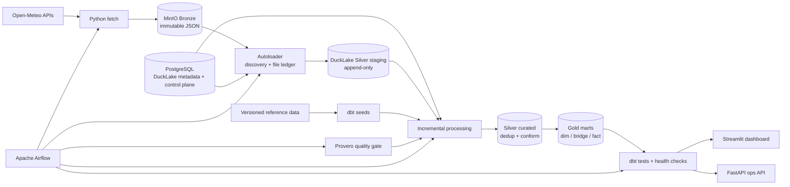

# Hanoi Flood & Climate Risk Monitor
### Rainfall Pressure & Historical Replay System


## Problem Statement

Hanoi is exposed to recurring heavy-rain and urban flooding events, but the data
available to a small engineering project does not support a calibrated
street-level flood probability model.

This project focuses on a narrower, defensible problem: build a reproducible data
platform that ingests hourly forecasts and historical rainfall, preserves source
history, validates data quality, and surfaces an explainable **rainfall-pressure
signal** for Hanoi's 126 wards/communes.

The platform answers questions such as:

- how much rain is expected over the next 1, 3, 6, 12, and 24 hours;
- which wards should be reviewed first based on forecast rainfall pressure;
- whether that signal persists across recent forecast runs;
- whether the latest forecast is rising or falling relative to the previous run;
- whether the current data is complete, fresh, and safe to publish;
- what historical rainfall looked like around sourced flood observations.

The output is an operational rainfall-pressure signal, not an official weather
warning or flood-probability forecast.

## Project Architecture



The deployment target is intentionally small:

```text
Open-Meteo -> MinIO Bronze -> DuckLake Silver -> DuckLake Gold -> Dashboard/API
                         \-> PostgreSQL control plane
Airflow orchestrates fetch, load, quality, transform, and maintenance.
```

## Tech Stack

### Lakehouse & Storage


### Data Engineering


### Orchestration & Quality


### Serving


### Containerization


### Programming Languages


### Key Libraries

- `duckdb` - query engine and DuckLake access
- `dbt-duckdb` - Silver/Gold transformations and tests
- `minio` - object storage client
- `psycopg` - PostgreSQL control-plane access
- `provero` - staging data-quality checks
- `streamlit` - dashboard UI
- `pydeck` - map rendering
- `altair` - charts
- `fastapi` / `uvicorn` - operational API
- `pandas` - dashboard-side tabular rendering

## Project Structure

```text
vn-climate-risk-monitor/
│
├── docker-compose.yml
├── pyproject.toml
├── uv.lock
├── .env.example
│
├── docker/
│   ├── airflow.Dockerfile
│   └── dashboard.Dockerfile
│
├── src/
│   ├── fetch/                     # HTTP landing + concurrent fetch pool
│   ├── autoloader/                # discovery, file ledger, lease-based loading
│   ├── processing/                # incremental processing + checkpoints
│   └── vn_climate_risk_monitor/   # domain, storage, health, Open-Meteo logic
│
├── sources/                       # source contracts + parsing SQL
│   ├── open_meteo_forecast.yml
│   ├── open_meteo_forecast.sql
│   ├── open_meteo_archive.yml
│   ├── open_meteo_archive_hourly.sql
│   └── open_meteo_ifs.yml
│
├── transform/
│   ├── models/staging/            # thin dbt source views
│   ├── models/intermediate/       # curated incremental models
│   ├── models/marts/              # dimensions, bridges, facts
│   ├── macros/
│   ├── seeds/
│   └── tests/                     # cross-row/business-invariant tests
│
├── processing/                    # process definitions for Silver/Gold runs
├── quality/                       # Provero staging checks
│
├── orchestration/
│   └── dags/
│       ├── forecast_hourly_dag.py
│       ├── archive_monthly_dag.py
│       └── lakehouse_maintenance_dag.py
│
├── serving/
│   ├── api/                       # FastAPI operational endpoint
│   └── dashboard/                 # Streamlit application and pages
│
├── reference/                     # versioned geographic reference files
├── scripts/                       # bootstrap, health, dbt wrapper, recovery
├── tests/unit/                    # Python unit tests
└── docs/                          # architecture, modeling, runbooks, governance
```

See [Repository Structure](docs/03a-repo-structure.md) for the detailed map.

## Data Sources

| Source | Type | Coverage / scope | Used for |
|---|---|---|---|
| Open-Meteo Forecast API | Hourly forecast | 126 Hanoi wards, 72-hour horizon | Current forecast and rainfall-pressure signal |
| Open-Meteo Historical Weather API | ERA5 archive | Before 2017 | Historical rainfall baseline/replay |
| Open-Meteo Historical Forecast API | ECMWF IFS archive | 2017 onward | Higher-resolution historical replay |
| Ward coordinate seed | CSV | 126 wards/communes | Geography dimension |
| Ward-grid mapping seed | CSV | Forecast/archive grid mapping | Ward-to-grid bridge |
| S13 ward polygons | GeoJSON | 126 Hanoi wards/communes | Dashboard maps and geocoding |
| Flood point seed | Curated CSV | Sourced flood locations | Map/replay reference |
| Flood observation seeds | Curated source + reviewed geocode | Sourced flood observations | Historical replay comparison |

Forecast runs are versioned instead of overwritten. Historical archive data uses
ERA5 before 2017 and ECMWF IFS from 2017 onward; the two are kept distinct in the
model because they are not one homogeneous time series.

More detail: [Data Sources](docs/02-data-sources.md).

## Pipeline Phases

- [x] Phase 1: Source contracts, geography, and reference seeds
- [x] Phase 2: Immutable Bronze landing in MinIO
- [x] Phase 3: Autoloader discovery and Silver staging
- [x] Phase 4: Incremental Silver/Gold processing with dbt
- [x] Phase 5: Provero, dbt, and operational health gates
- [x] Phase 6: Hourly forecast orchestration in Airflow
- [x] Phase 7: Monthly archive refresh and daily lakehouse maintenance
- [x] Phase 8: Streamlit dashboard and FastAPI operational serving
- [x] Phase 9: Backup, recovery, governance, and runbooks

The main production flow is:

```text
fetch -> load -> staging quality -> Silver -> Gold -> health gate -> serving
```

Scheduled DAGs:

| DAG | Schedule | Purpose |
|---|---|---|
| `open_meteo_forecast_hourly` | `15 * * * *` | Fetch, validate, transform, and publish hourly forecast data |
| `open_meteo_archive_monthly` | `30 2 1 * *` | Load the previous completed archive month |
| `lakehouse_maintenance_daily` | `30 3 * * *` | Expire old DuckLake snapshots and clean eligible files |

## Dashboard

The Streamlit application exposes three operational views.

### Forecast Map

Shows the current complete forecast run and rainfall-pressure signal across Hanoi.
The map is ward-oriented, while rainfall values retain the source weather-grid
semantics underneath.

### Ward Drilldown

Explores one ward in more detail, including forward rainfall windows, pressure
level, persistence, and forecast revision behavior.

### Archive Replay

Replays historical rainfall and compares it with sourced flood observations where
the observation has enough verified metadata to be eligible for replay.

After startup, open:

- Dashboard: [http://localhost:8501](http://localhost:8501)
- Airflow: [http://localhost:8080](http://localhost:8080)
- MinIO Console: [http://localhost:9001](http://localhost:9001)
- pgAdmin: [http://localhost:5050](http://localhost:5050)

See [Serving & BI](docs/08-serving-bi.md) for query and serving behavior.

## Steps to Reproduce

### Prerequisites

Only Docker with Docker Compose is required for the default local runtime.

| Tool | Purpose |
|---|---|
| Docker Desktop / Docker Engine | Run PostgreSQL, MinIO, Airflow, bootstrap, and dashboard services |
| Docker Compose | Build and start the complete local stack |
| Python 3.12+ and `uv` | Optional; only needed for host-side development commands |

No `.env` file is required for the default local stack. Compose generates and
persists local runtime secrets in the `runtime_secrets` named volume.

---

### 1. Clone the repository

```bash
git clone https://github.com/DKSang/vn-climate-risk-monitor.git
cd vn-climate-risk-monitor
```

---

### 2. Start the full stack

```bash
docker compose up -d --build
```

The first startup:

- generates local runtime secrets;
- starts PostgreSQL and MinIO;
- creates the DuckLake catalog and control-plane schemas;
- seeds geography/reference data;
- builds static geography models;
- starts Airflow and the Streamlit dashboard.

Use `.env.example` only when you need to override ports, Open-Meteo settings, or
provide deterministic local credentials before the first startup.

---

### 3. Check the services

```bash
docker compose ps
```

To re-run the idempotent bootstrap manually:

```bash
docker compose run --rm bootstrap
```

---

### 4. Enable scheduled DAGs

New DAGs start paused by default in the local stack. Enable the flows you want to
run:

```bash
docker compose exec airflow airflow dags unpause open_meteo_forecast_hourly
docker compose exec airflow airflow dags unpause open_meteo_archive_monthly
docker compose exec airflow airflow dags unpause lakehouse_maintenance_daily
```

---

### 5. Trigger the forecast pipeline

```bash
docker compose exec airflow airflow dags trigger open_meteo_forecast_hourly
```

The DAG runs:

```text
fetch forecast
  -> load staging
  -> Provero checks
  -> forecast health checks
  -> Silver processing
  -> Gold processing
  -> Gold health gate
```

---

### 6. Run one-off ingestion commands

Fetch commands are dry-run unless `--execute` is present.

```bash
docker compose exec -T airflow uv run fetch-open-meteo forecast --execute

docker compose exec -T airflow uv run fetch-open-meteo archive \
  --start 2026-01-01 \
  --end 2026-02-01 \
  --execute

docker compose exec -T airflow uv run load-sources open_meteo_forecast
docker compose exec -T airflow uv run load-sources open_meteo_archive open_meteo_ifs
```

---

### 7. Run transformations and quality checks

```bash
docker compose exec -T airflow uv run python scripts/run_processing.py run forecast_silver
docker compose exec -T airflow uv run python scripts/run_processing.py run forecast_gold

docker compose exec -T airflow uv run provero run \
  -c quality/provero.yaml --no-optimize --no-store

docker compose exec -T airflow uv run python scripts/run_dbt.py test \
  --project-dir transform --profiles-dir transform

docker compose exec -T airflow uv run python scripts/healthcheck.py \
  --scope all --require-gold
```

All runtime commands execute inside the Airflow container so they use the same
locked dependencies and generated secrets as scheduled DAGs.

---

### 8. Run host-side development checks (optional)

Install the development environment only when working on the codebase itself:

```bash
uv sync --dev
uv run ruff check .
uv run pytest
uv run python scripts/check_docs.py
```

## Documentation

The README stays at project-overview level. Detailed design and operating notes
live in focused documents:

- [Business Problem](docs/01-business-problem.md)
- [Data Sources](docs/02-data-sources.md)
- [Architecture](docs/03-architecture.md)
- [Repository Structure](docs/03a-repo-structure.md)
- [Lakehouse Setup](docs/04a-lakehouse-setup.md)
- [Ingestion Runbook](docs/04b-ingestion-runbook.md)
- [KPI Methodology](docs/05-kpi-methodology.md)
- [Storage & Modeling](docs/06-storage-modeling.md)
- [Data Quality & Observability](docs/07-data-quality.md)
- [Serving & BI](docs/08-serving-bi.md)
- [Governance](docs/09-governance.md)

## Data Usage

Open-Meteo Free API is used for non-commercial portfolio purposes. Published
Open-Meteo-derived data should retain source attribution. Reference datasets and
media-derived observations remain subject to their original source terms.
