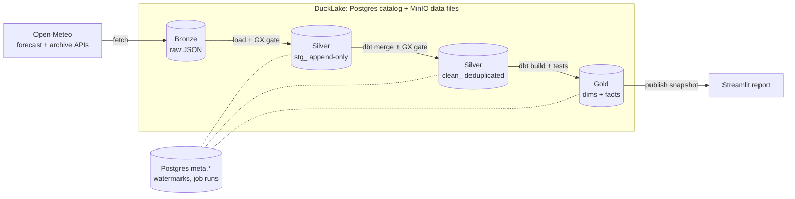

# 1. Architecture

A single-node batch lakehouse: Python lands and loads raw data, dbt transforms
it, Airflow schedules it and Streamlit reads the result. Every component runs
from one `docker compose up`.



## Components

| Component | Role in this project |
|---|---|
| **MinIO** | S3-compatible object store for Bronze objects and DuckLake's Parquet files |
| **Postgres** | DuckLake catalog (schema `ducklake`), pipeline control tables (`meta`), Airflow metadata (`airflow`) |
| **DuckDB + DuckLake** | SQL engine and table format: ACID tables, snapshots and time travel over MinIO |
| **Python (`pipeline/`)** | Fetch, load, the Great Expectations gates, running dbt, publication |
| **dbt (`transform/`)** | Silver clean tables and the Gold model, with their tests |
| **Great Expectations** | Data-quality gates after Bronze and after Silver ([3. Data quality](03-data-quality.md)) |
| **Airflow** | Schedules, retries, backfill and the single-writer pool |
| **Streamlit** | Power BI-style report that reads one published snapshot |

## Layers

| Layer | Written by | Tables / objects | Behaviour |
|---|---|---|---|
| Bronze | `fetch` | `bronze/open_meteo/{forecast,archive}/year=/month=/…/batch_NNN.json` | The API response bytes, never rewritten |
| Silver staging | `load` (Python) | `silver.stg_open_meteo_forecast`, `silver.stg_open_meteo_archive` | Append-only; every row keeps `_source_file` and `_inserted_at` |
| Silver clean | `clean` (dbt) | `silver.clean_weather_forecast_hourly`, `silver.clean_weather_archive_hourly` | Deduplicated, typed, merged on the business key |
| Gold | `gold` (dbt) | `gold.dim_*`, `gold.bridge_ward_grid`, `gold.fct_*` | Star schema for the report; see [2. Data contracts](02-data-contracts.md) |

## Pipelines

Both data DAGs run the same five tasks, one command each:

```text
init -> fetch -> load -> clean -> gold
```

| DAG | Schedule | Unit of work |
|---|---|---|
| `open_meteo_forecast_hourly` | `15 * * * *` | One forecast run: the 72-hour forecast fetched at that hour |
| `open_meteo_archive_monthly` | `30 2 6 * *` | One calendar month; history comes from `airflow dags backfill` |
| `lakehouse_maintenance_daily` | `30 3 * * *` | Expire snapshots older than 7 days, delete unreferenced files |

`init` is idempotent: it creates the bucket, the `silver`/`gold` schemas and the
`meta` tables.

## Key decisions

- **Incremental processing with start-time watermarks** kept in Postgres, one
  mechanism for the Python loader and dbt
  ([ADR 0001](adr/0001-watermark-incremental-pattern.md)).
- **Publication is a DuckLake snapshot tagged `publish`**; the report pins it,
  so it never reads a half-built Gold
  ([ADR 0002](adr/0002-publish-a-ducklake-snapshot.md)).
- **Great Expectations checks the data; dbt tests check the logic**
  ([ADR 0003](adr/0003-great-expectations-gates-and-dbt-tests.md)).

## Trade-offs

- **Single node, single writer.** Airflow's `lakehouse_single_writer_pool` has
  one slot, so only one task writes to DuckLake at a time. Recovery stays simple,
  but there is no high availability and no parallel writers.
- **Bronze before tables.** Keeping raw responses costs storage and one extra
  step, but any table can be rebuilt from Bronze, and a bad response can be
  inspected byte for byte.
- **DuckDB, not a warehouse.** A few hundred thousand rows a month fit easily on
  one machine; a cluster (Spark, Kubernetes, Kafka) would add cost without
  benefit at this volume.
- **Static references are dbt seeds.** Wards and their weather-grid cells change
  rarely, so they are reviewed CSVs produced once by `scripts/`, not a pipeline.
