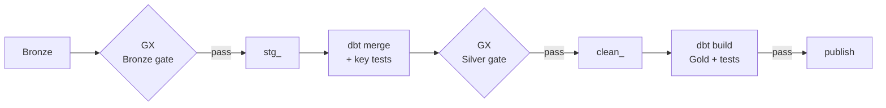

# 3. Data quality

Two tools, two jobs ([ADR 0003](adr/0003-great-expectations-gates-and-dbt-tests.md)):

- **Great Expectations** checks the *data*: did the source deliver what we
  expect? It runs after Bronze and after Silver.
- **dbt tests** check the *transformation*: keys, relationships and business
  rules of the models, as part of every `dbt build`.

A failure at any point stops the run before the watermark moves or anything is
published. The next run retries the same rows, and the report keeps showing the
last good snapshot.

## Great Expectations gates (`pipeline/quality.py`)

Each forecast run and each archive month is validated on its own. Several can
wait after an outage, and one bad batch must not hide behind good ones.

| Gate | Dimension | Forecast (per run) | Archive (per month) |
|---|---|---|---|
| Bronze → `stg_` | Volume | rows = 48 cells × 72 hours | rows = 48 cells × hours in month |
| | Completeness | key and `forecast_run` not null | key not null |
| | Uniqueness | one row per cell × hour | one row per cell × hour |
| | Validity | rain fields 0–500 mm, probability 0–100 %, lead time 0–96 h | rain fields 0–500 mm |
| | Freshness | newest run reaches ≥ 48 h ahead of now | none: history is backfilled |
| `clean_` after merge | Volume | every touched run is still complete | every touched month is still complete |
| | Validity | mm ranges, probability, WMO `weather_code` 0–99 | mm ranges, `weather_code` 0–99 |

The Silver gate re-reads *all* rows of every run or month the merge touched, not
just the new rows. Volume then means "the whole run is there", which is what
Gold relies on.

## dbt tests (`transform/`)

| Test | Where | Guards |
|---|---|---|
| `unique_combination`, `not_null`, `unique` | every clean and Gold model | The declared grain and keys |
| `relationships` | bridge and facts → `dim_ward`, `dim_grid` | No orphan grid cells or wards |
| `accepted_values` | `fct_rain_pressure_alert.pressure_level` | The five levels only |
| `rain_windows_monotonic` (generic) | both rain facts | A 24 h window never totals less than a 12 h one, and so on |
| `assert_forecast_forward_coverage` | forecast fact | Each run has a complete forward horizon from its first hour |
| `assert_pressure_covers_current_forecast` | pressure alert | Every ward × hour of the current forecast has a pressure row |
| `assert_pressure_semantics` | pressure alert | Score within 0–100; `NORMAL` only with complete inputs |
| `assert_ward_grid_covers_every_ward` | bridge | Every ward maps to exactly one grid cell |
| unit test `rain_windows_sum_whole_hours_and_are_null_when_incomplete` | forecast fact | Window arithmetic on a hand-made input |

58 data tests and 1 unit test in total (`dbt ls --resource-type test`).

## Python tests (`tests/`)

41 pytest tests run against real Postgres and an S3 server (MinIO locally, moto
in CI). They cover the behaviour at each seam:

- fetch: skipping landed batches, retries, rejecting error payloads;
- load: the watermark, lineage, and the GX gates rejecting bad batches;
- clean and Gold: dedup-then-merge, windows across month boundaries, publication;
- the report: its queries and every page, rendered with Streamlit's `AppTest`.
